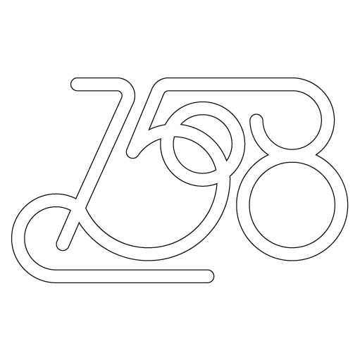
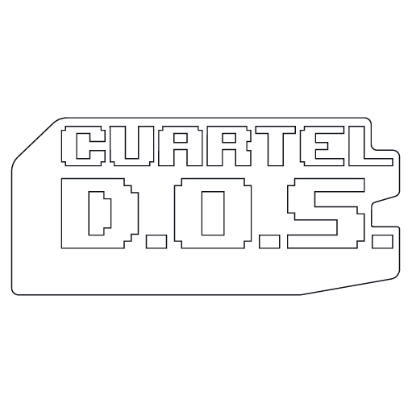
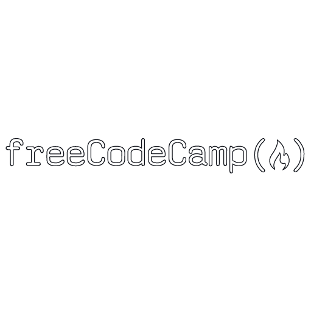
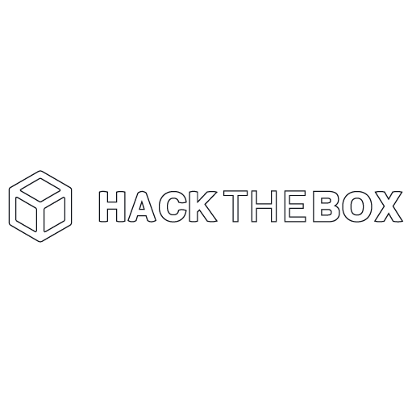

        

        #WebDeveloper | #HxC | #CreativeDev
    

     
    

    I am a developer, I plan, develop and bring to production applications focused on the web, a taste for ✨creative development🎨 and new technologies. He worked in different areas of the markets,from advertising agencies, non-profit organizations, crypto and artistic projects. I have an interest in augmented reality and virtual reality, currently I am seeking to get certified in the technologies that I master, step by step one by one and complete my learning paths in HxB.
    

 
 
<table align="center">
        <tr>
            <td>
                

                    <b>💡 F r o n t e n d 💡</b>
                

            </td>
            <td>
                

                    <b>💡 B a c k e n d 💡</b>
                

            </td>
        </tr>
        <tr>
            <td>
                

        
        
        
        
        </a>
        
        

       

               
        
        
               
        
       
 
    

        

        
                
        
        
                
    

        

        
        
        
    

            </td>
            <td>
                

                    
                    
                    
                    
                

                    

        
        
        
        
    

                    

        
        
        
        
    

            </td>
        </tr>
    </table>
 
 

     <b>✨You can see some training projects  where I demonstrate my technical skills in different stacks.✨</b>

 
 
<table align="center">
        <tr>
            <td>
                

                    <b> 📚 repositories frontend </b>
                

            </td>
            <td>
                

                   <b> 📚 repositories backend </b>
                

            </td>
        </tr>
        <tr>
            <td>
                <ul>
                   <li><a href="https://github.com/Frontementor-challengues" target="_blank">Webs</a></li>
                   <li><a href="https://github.com/React-ts-learn" target="_blank">React</a></li>
                   <li><a href="https://github.com/Next-learn" target="_blank">Next JS</a></li>
                <ul>
            </td>
                <td>
                 <ul>
                         <li><a href="https://github.com/Node-ts-learn">Node</a></li>
                         <li><a href="https://github.com/Node-ts-learn">Nest JS</a></li>
                 </ul>
            </td>
        </tr>
    </table>
                         
                        

       <b>💻🪄In my workflow I use the following tools🪄</b>         

 
<table align="center">
        <tr>
            <td>
                

                   <b> 🪄⚙️ tools </b>
                

            </td>
        </tr>
        <tr>
        <td>
                    

                            
        
        
        
        </a>
        
        
        
        

        

        
        
        
        
                            
        

            </td>
        </tr>
    </table>

       <b>✨🧠✨ Some projects I have participated in   and of which I am deeply proud ✨🫀✨</b>

        
        
         
        
        

 
 

       <b>✨🧠✨ I am always in constant training and practice.  These are some of the djos where I train ✨🫀✨</b>

        
        

         
        

       <b>✨🧠✨ Remember to visit my portfolio or any of my other projects ✨🫀✨</b>

        

        056c32e64a3ef8e8d770033e2688f616

